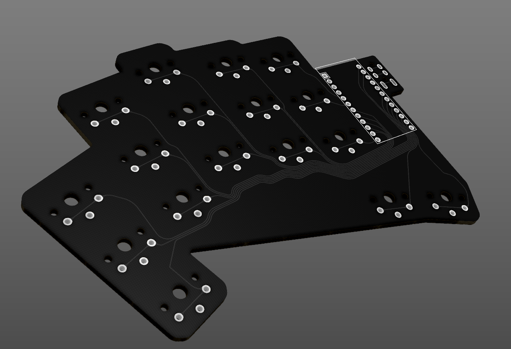

# Simplified Architeuthis dux




Simplified versions of [tapioki](https://github.com/tapioki)'s [Architeuthis dux](https://github.com/tapioki/cephalopoda/tree/main/Architeuthis%20dux) with hotswap socket and puck support removed.

## Instructions
To build an Architeuthis dux, you need the following:
* 2 [pro-micro](https://www.aliexpress.com/item/32971098005.html) controllers
* 2 [PJ320A](https://www.aliexpress.com/item/1005001928651798.html) audio jack
* 1 male-to-male [TRRS](https://www.aliexpress.com/item/32961128759.html) cable
* 34 [Kailh choc v1](https://www.aliexpress.com/item/4000907409650.html) switches and [keycaps](https://boardsource.xyz/store/5f6ef2d68e3bf05ab838f918)
* Rubber feet or bumbers for the bottom

Note: Architeuthis dux is a double sided PCB so controllers face down on the left and face up on the right.

## QMK Firmware
To build the QMK firmware, run:
```
qmk compile -kb a_dux -km default
```
