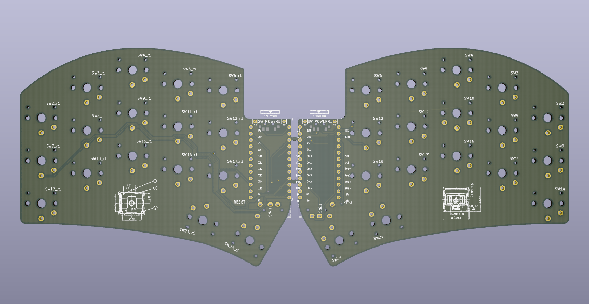

# Minimalist Ferris Sweep PCBs

Simplified Ferris [Sweepv2](https://github.com/davidphilipbarr/Sweep/tree/main/Sweepv2) and [Half-swept](https://github.com/davidphilipbarr/Sweep/tree/main/Sweep-half-swept) with the following changes:
* Removed mascot cut-out logo and broom
* Removed puck support
* Removed battery and power switch pads
* Removed reset switch on half-swept
* Corrected silkscreen text alignment
* Added choc switch silkscreen from Pierre's [Ferris v0.1](https://github.com/pierrechevalier83/ferris/tree/main/0.1)
