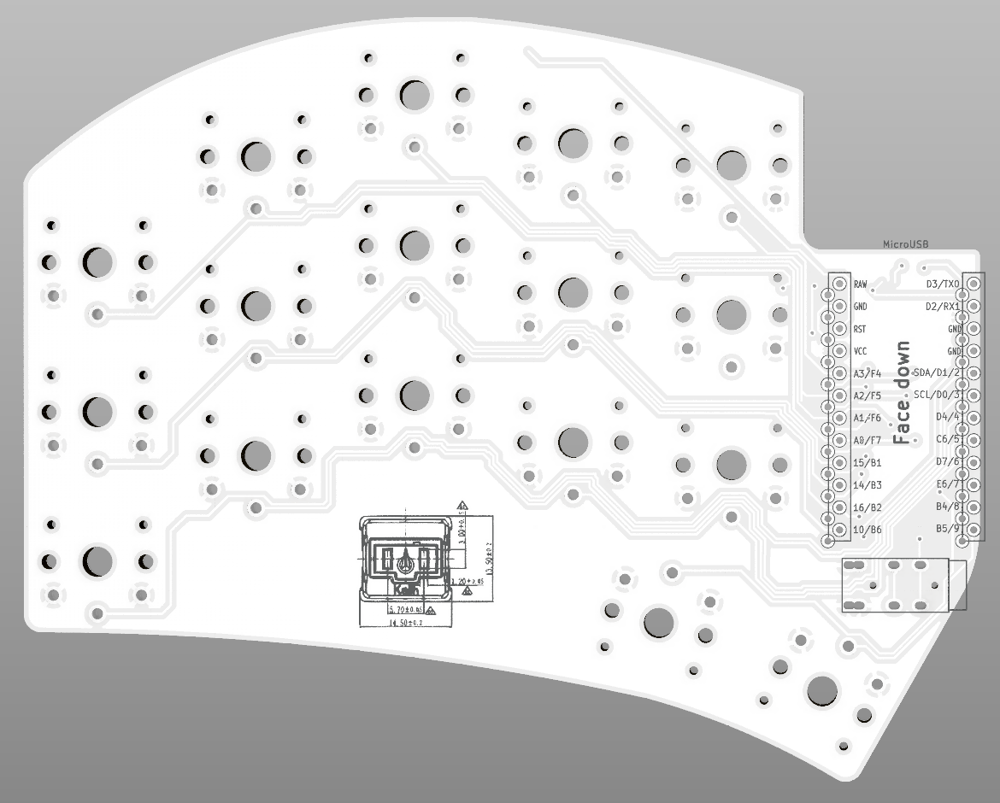
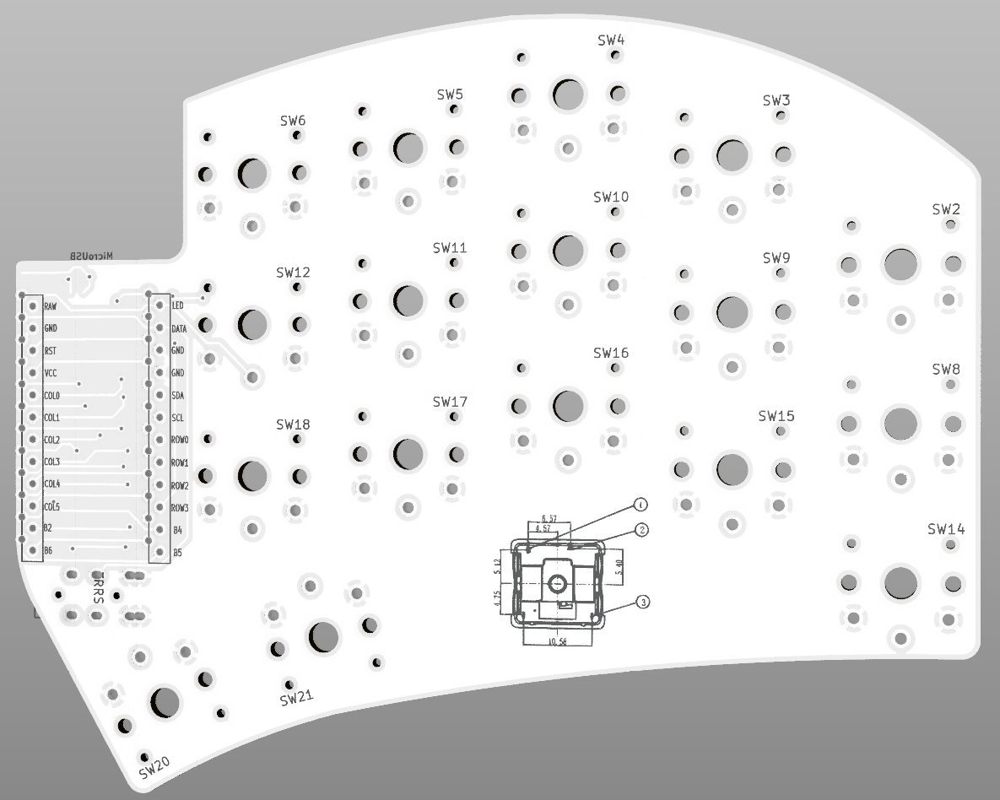

# Minimalist Ferris Sweep PCBs

Simplified Ferris [Sweepv2](https://github.com/davidphilipbarr/Sweep/tree/main/Sweepv2) and [Half-swept](https://github.com/davidphilipbarr/Sweep/tree/main/Sweep-half-swept) with the following changes:
* Removed mascot, puck and battery support
* Removed reset switch on half-swept
* Corrected MCU pin labels and alignment
* Added switch silkscreen from Pierre's [Ferris v0.1](https://github.com/pierrechevalier83/ferris/tree/main/0.1)

## How To Build
See David Barr's [Sweep](https://github.com/davidphilipbarr/Sweep) page for instructions.

## Designed By
* [Pierre Chevalier](https://github.com/pierrechevalier83/ferris/)
* [David Barr](https://github.com/davidphilipbarr/Sweep/)
* [Ibnu Daru Aji](https://github.com/ibnuda/)
