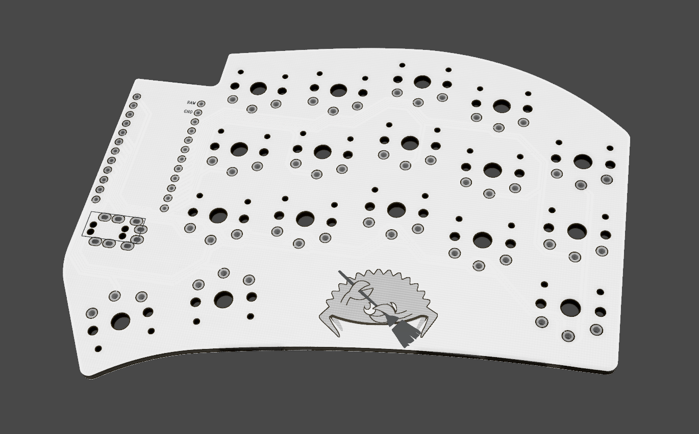

# Modified Sweep34

Minimal version of [Sweep34](https://github.com/davidphilipbarr/Sweep/tree/main/Sweep34) with the following changes:
* Removed reset switch
* Corrected MCU pin labels and alignment

## Designed By
* [Pierre Chevalier](https://github.com/pierrechevalier83/ferris/)
* [David Barr](https://github.com/davidphilipbarr/Sweep/)
* [Ibnu Daru Aji](https://github.com/ibnuda/)

