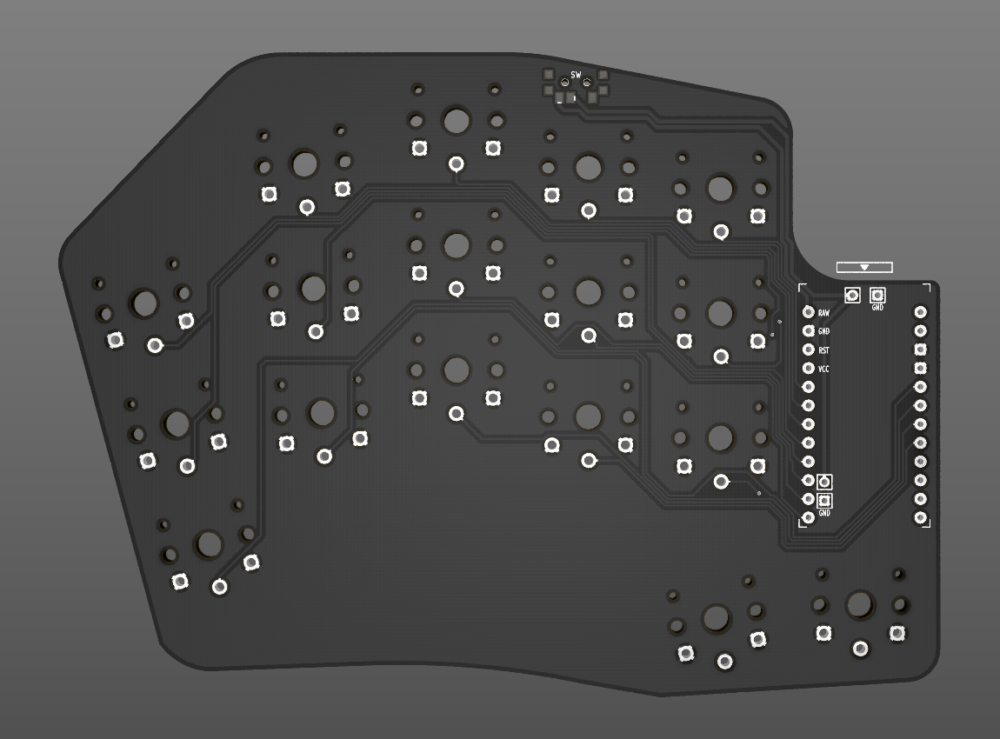
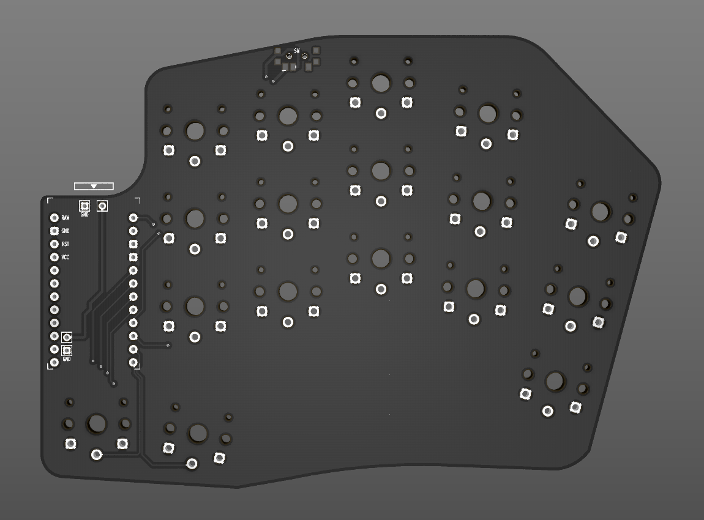

# Simplified Hypergolic

Modified version of [@davidphilipbarr](https://github.com/davidphilipbarr)'s [hypergolic 1.2 bm](https://github.com/davidphilipbarr/hypergolic/tree/main/hypergolic%20V1.2%20bm) with puck support and reset removed, silkscreen corrected and simplified.

## Instructions
To build the Hypergolic, you need the following:
* 2 [Nice!Nano](https://nicekeyboards.com/nice-nano/) controllers
* 2 [301230 3.7v lithium polymer](https://www.aliexpress.com/item/4000336502739.html) rechargeable battery
* 2 [MSK-12C02](https://www.aliexpress.com/item/1005001689519742.html) SMD slide switch
* 34 [Kailh choc v1](https://www.aliexpress.com/item/4000907409650.html) switches and [keycaps](https://boardsource.xyz/store/5f6ef2d68e3bf05ab838f918)
* Rubber feet or bumbers for the bottom

